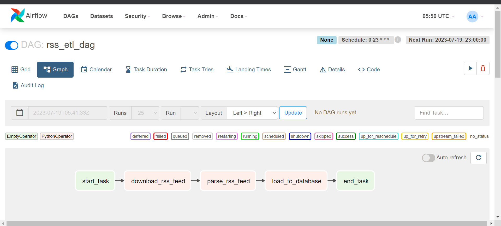

# OBJECTIVE
The objective of this DAG is to download the RSS feed and save it with the timestamp in the filename, extract whatever information you want from that file and load it in any kind of database you want.

# TASK
 - A task to download the RSS feed and that task should store the downloaded content in local with the filename containing the timestamp (raw_rss_feed_yyyymmddhhss.xml) and also it pushes that saved filename to xcom
 - A task that picks up the raw xml filename from the xcom  and parses it and extracts some information (Whatever information that you like) and saves them in a csv file with filename (curated_yyyymmddhhss.csv) and pushes the csv filename to xcom
 - A task that picks up the curated csv filename from the xcom and reads the CSV file and loads into any kind of database you like.

# SNAPSHOTS
